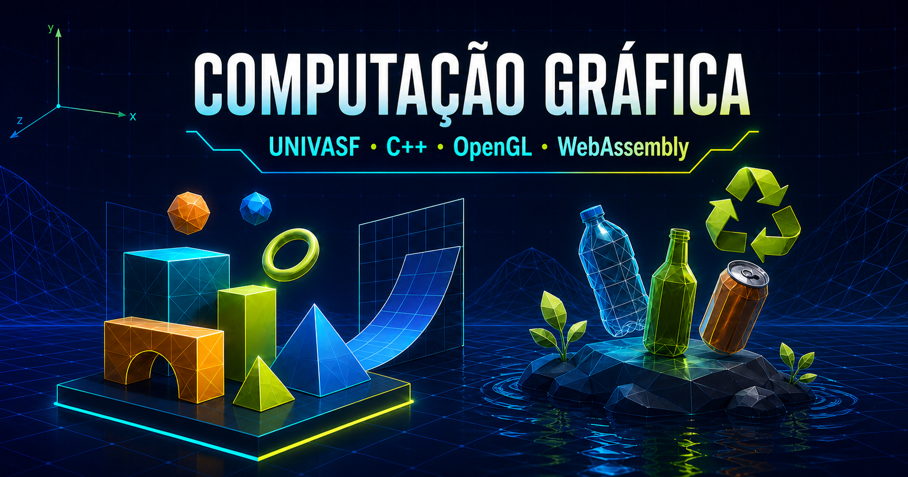
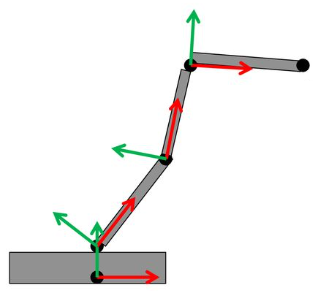
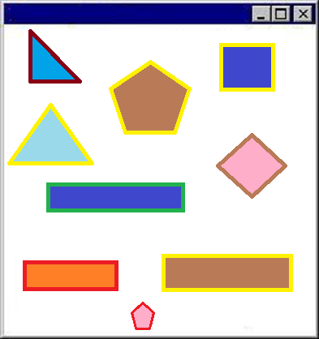

<p align="center">
  
</p>

# 🎨 Computação Gráfica — UNIVASF


Coleção de atividades práticas e do projeto final da disciplina de **Computação Gráfica**, ministrada pelo professor **Jorge Luis Cavalcanti Ramos** no curso de **Engenharia de Computação da UNIVASF**, durante o período **2021.2**.

Os programas usam uma única base de código C++ para execução nativa com OpenGL/FreeGLUT e para execução no navegador por meio de WebAssembly.

## ✨ Entregas

### Hierarquia e transformações geométricas

Objeto articulado formado por uma base e três braços. O exercício demonstra translação, rotação, escala, pilha de matrizes e transformações hierárquicas.



| Entrada   | Ação                        |
| --------- | --------------------------- |
| Setas     | Movimentar a base           |
| `Q` / `W` | Rotacionar o primeiro braço |
| `A` / `S` | Rotacionar o segundo braço  |
| `Z` / `X` | Rotacionar o terceiro braço |
| `Esc`     | Encerrar a versão nativa    |

[Executar no navegador](https://mateusjrcavalcanti.github.io/praticas-de-computacao-grafica/atividades/hierarquia-transformacoes) · [Código C++](atividades/hierarquia-transformacoes/src/main.cpp)

### Desafio dos obstáculos

Jogo 2D para atravessar uma pista, desviar de sete formas geométricas e alcançar a faixa verde. O jogador possui três vidas; uma colisão o devolve ao início. A interface informa vidas e progresso, e a partida termina em vitória ou derrota.



| Entrada | Ação                     |
| ------- | ------------------------ |
| Setas   | Movimentar o jogador     |
| `R`     | Reiniciar a partida      |
| `Esc`   | Encerrar a versão nativa |

[Executar no navegador](https://mateusjrcavalcanti.github.io/praticas-de-computacao-grafica/atividades/desafio-obstaculos) · [Código C++](atividades/desafio-obstaculos/src/main.cpp)

### Colete o lixo

Projeto final no qual resíduos animados devem ser coletados antes de chegarem ao lago. O cenário e os objetos usam texturas, com interação pelo mouse, vidas, pontuação e controle de velocidade.


| Entrada              | Ação                     |
| -------------------- | ------------------------ |
| Botão `Iniciar jogo` | Começar a partida        |
| Clique esquerdo      | Coletar um resíduo       |
| Seta para cima/baixo | Alterar a velocidade     |
| `P`                  | Pausar ou continuar      |
| `R`                  | Reiniciar a partida      |
| `Esc`                | Encerrar a versão nativa |

[Executar no navegador](https://mateusjrcavalcanti.github.io/praticas-de-computacao-grafica/atividades/projeto-final) · [Código C++](atividades/projeto-final/src/main.cpp)

As versões WebAssembly são geradas automaticamente durante o build. As texturas do projeto final são incluídas no sistema de arquivos virtual do Emscripten.

## 🧰 Tecnologias

- **C++17**, **OpenGL** e **FreeGLUT**.
- **stb_image** para carregamento de imagens.
- **Emscripten** e **WebAssembly** para o navegador.
- **React, TypeScript, Vite e Tailwind CSS** para o site.
- **GitHub Actions e Pages** para publicação.

## 📁 Estrutura

```text
atividades/
  hierarquia-transformacoes/{src,assets}
  desafio-obstaculos/{src,assets}
  projeto-final/{src,include,assets}
www/src/{components,pages,App.tsx}
www/public/{assets,wasm,og.png}
scripts/{build-native.ps1,build-web.ps1}
```

## 🚀 Compilação nativa

Compile os executáveis com um único comando:

```powershell
npm --prefix www run build:native
```

O sistema operacional e as dependências são verificados automaticamente. Se necessário, o GCC e o FreeGLUT são instalados antes da compilação. Os executáveis e as texturas serão colocados diretamente em `build`.

## 📦 Versões e executáveis

A versão oficial do projeto é definida em `www/package.json`. Tags no formato `vX.Y.Z` acionam automaticamente uma GitHub Release com os seguintes pacotes:

- `windows-x64.zip`, com os executáveis, assets e DLLs necessárias;
- `linux-x64.tar.gz`, que requer o FreeGLUT instalado no sistema;
- `macos-x64.tar.gz`, compilado com os frameworks OpenGL e GLUT do macOS.

Para preparar uma nova versão, escolha `patch`, `minor` ou `major`:

```powershell
cd www
pnpm version patch --no-git-tag-version
cd ..
git add www/package.json
git commit -m "release: vX.Y.Z"
git tag vX.Y.Z
git push origin main
git push origin vX.Y.Z
```

O workflow confere se a tag corresponde exatamente à versão do pacote antes de compilar. Cada arquivo publicado também contém um `VERSAO.txt` com a versão, o sistema e a arquitetura do build.

## 🌐 Compilação WebAssembly

Compile o WebAssembly e o site Vite com um único comando:

```powershell
npm --prefix www run build
```

O Emscripten é localizado ou instalado automaticamente em `.tools/emsdk`; em seguida, o WebAssembly e a aplicação Vite são compilados.

Para iniciar a interface em desenvolvimento:

```powershell
npm --prefix www install
npm --prefix www run dev
```

## ✅ Qualidade de código

```powershell
npm --prefix www run lint          # verifica React e TypeScript com ESLint
npm --prefix www run format:check  # verifica a formatação
npm --prefix www run format        # aplica a formatação com Prettier
```
